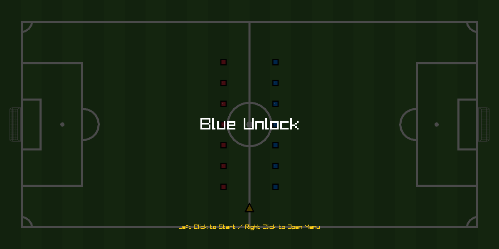

# Blue Unlock

> A cozy football game built with Raylib, inspired by the manga/anime "Blue Lock".

## About

It is come from the project *Simple Ping Pong* game, and took a week to make it. I also challenge to myself. I WON'T USE ANY OTHERS ASSETS FOR CREATING THIS. But I used audio files :P. Okay. Just let it to be an exception of audio files. 

> This game could be in production. Also didn't add yet, primary features like football physics😅.

## Features

- **Primitive-Only Rendering:** All visuals are drawn using Raylib's basic shapes (like `DrawRectangle`, `DrawCircle`) without any external visual assets (except audio).
- **Custom Pixel Font:** A custom font built entirely using `DrawRectangle()` calls.
- **Player Movement:** Smooth WASD controls with `Lerp`-based camera follow.
- **Stamina System:** Sprinting and kicking consume stamina, which regenerates over time.
- **Dynamic HUD:** Custom UI (HUD) designed with a clean, minimalist style.
- **Audio Integration:** Sound effects loaded for immersion.

## Screenshots




## Requirements

- **C99** (and higher)
- **CMake**
- **Raylib**

## Installation

```Bash
mkdir build && cd build
cmake -S .. -B . -DCMAKE_BUILD_TYPE=Release
cmake --build .
```

Run the compiled executable:
```Bash
./game
```

Basic Controls (v0.0.3 Alpha):
- Move with WASD keys
- For sprint running, use left side shift and WASD key (it will consume your stamina as a payment)
- `Space` bar for colliding others (it won't not effect on Referee)
- `F4`  : mute audio
- `F8`  : rotate your viewing angle
- `F9`  : toggle your view port scale
- `F10` : toggle the bottom of stamina bar
- `F11` : screenshots (I think... it might be broken just for current version🙏)

## Project Structure

```
.
├── assets
│   └── audios
│       ├── ball-bouncing.wav
│       ├── floodlight.mp3
│       ├── floodlight.wav
│       ├── football-before-match.mp3
│       └── football-fan-shout.mp3
├── CMakeLists.txt
├── compile_commands.json -> compile_commands.json
├── docs
│   ├── first-version.png
│   ├── recreation-v3.png
│   ├── screenshots
│   ├── second-version.png
│   └── todo.md
├── inc
│   ├── colour.h
│   ├── football
│   │   ├── pitch.h
│   │   ├── player.h
│   │   └── referee.h
│   ├── hud
│   │   └── shape.h
│   ├── managers
│   │   └── game.h
│   └── need.h
├── lib
├── README.md
├── src
│   ├── football-pitch.c
│   ├── football-player.c
│   ├── football-referee.c
│   ├── GameManager.c
│   ├── hud-shape.c
│   └── main.c
└── test
    └── main.test.c
```

## What I want this game to become🚩

- [ ] Footballers' textures to create as the humanoid
- [ ] Ball to create with textures
- [ ] Referee's activities as working well
- [ ] Goal stands to play with 2.5D or 3D perspective
- [ ] Multiple pitch design
- [ ] Footballers have different abilities that can be benefit for match
- [ ] Audiences field, the outside of pitch

## Contributing

Contributions, issues, and pull requests are welcome.

## License

This project is licenesed under the MIT License.
See ![[LICENSE]]  for details.

## Disclaimer / Credits:
This project is a personal, non-commercial fan-made game. It is heavily inspired by the manga/anime series "Blue Lock" (created by Muneyuki Kaneshiro and Yusuke Nomura). All rights to the original "Blue Lock" belong to their respective owners. This game is not affiliated with or endorsed by them.
